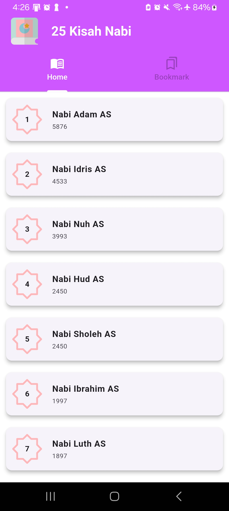
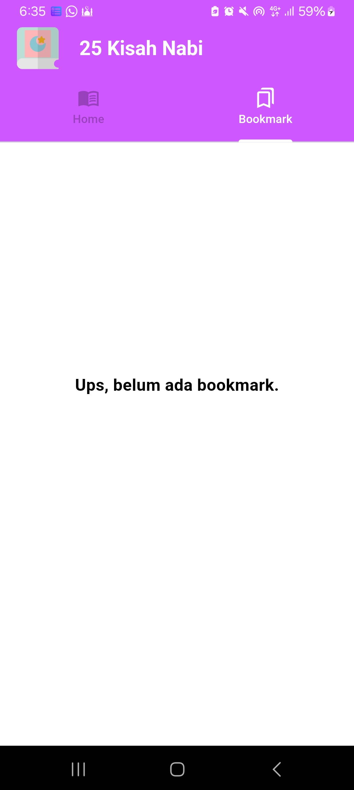

# ✨25 Kisah Nabi✨ 
 

25 kisah Nabi adalah aplikasi cerita Nabi yang berbasis Mobile dengan menggunakan framework Flutter. Terdapat 2 menu utama yang terdapat pada aplikasi ini yakni Home dan Bookmark

## Nama Kelompok
<table border="1">
  <thead>
    <tr>
      <td>No</td>
      <td>NIM</td>
      <td>Nama Anggota</td>
    </tr>
  <thead>
  <tbody>
    <tr>
      <td>1</td>
      <td>19220094</td>
      <td>Fitria Rahmawati</td>
    </tr>
    <tr>
      <td>2</td>
      <td>19220797</td>
      <td>Erni Najiatusalamah</td>
    </tr>
    <tr>
      <td>3</td>
      <td>19221267</td>
      <td>Rijal Dzaki Fakhrusalam</td>
    </tr>
    <tr>
      <td>4</td>
      <td>19221407</td>
      <td>Firda Awalia</td>
    </tr>
    <tr>
      <td>5</td>
      <td>19221137</td>
      <td>Mohammad Ali Hibrizi</td>
    </tr>
    <tr>
      <td>6</td>
      <td>19220298</td>
      <td>Adam Baihaqi</td>
    </tr>
  </tbody>
</table>

## 💻 Pengguna Sistem
Pengguna yang dapat memakai sistem ini adalah hanya User.

## 👨‍💻 Skenario Kebutuhan Pengguna
### User
<ol>
  <li>User dapat melihat dan memilih pada halaman home </li>
  <li>User dapat membaca kisah nabi yang diinginkan</li>
  <li>User dapat memasukkan kisah nabi yang disuka ke dalam halaman bookmark</li>
</ol>

## 🖼️ Screenshot Aplikasi
<table width="100%">
  <tbody>
    <tr>
      <td width="33%">
        <h5>Home</h5>
         
      </td>
      <td width="33%">
        <h5>Bookmark</h5>
        
      </td>
    </tr>
  </tbody>
</table>
<!-- Boleh tambahkan jumlah screenshot lebih dari 3 gambar agar lebih lengkap dalam pengenalan aplikasinya -->

## 📝 Prerequisite
Untuk menjalankan aplikasi ini disarankan untuk menyiapkan aplikasi berikut ini :
- [x] Android Studio Giraffe <code>2022.03.1 Patch 1</code>
- [x] Flutter <code>3.13.2</code>
- [x] Dart <code>3.1.0</code>
- [x] Java JDK <code>19.0.0</code>
- [x] Git <code>2.35.1</code>

## Credit
Project ini mengacu pada modul praktik dari mata kuliah Mobile Programming Universitas Bina Sarana Informatika (UBSI) yang diampu oleh Bpk. <a href="https://github.com/yuris60">Yuris Alkhalifi, M.Kom., CPDSA</a> selaku Dosen.